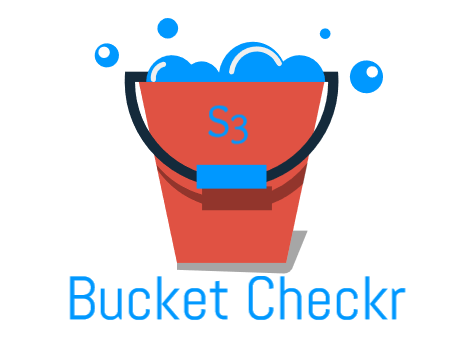

# S3BucketChecker
Enter any porposed name for your S3 bucket to see if it is available or already in use. 

Being that S3 allows your bucket to be used as a URL that can be accessed publicly, the bucket name that you choose must be globally unique. If some other account has already created a bucket with the name that you chose, you must use another name. This tools has been used by AWS Enterprise customers to quickly query available names as they begin to standarize on naming conventions across different business units. If the bucket is not found, then you are free to use it! 

Give it a try today: https://s3-us-west-2.amazonaws.com/www.s3bucketchecker.com/index.html
